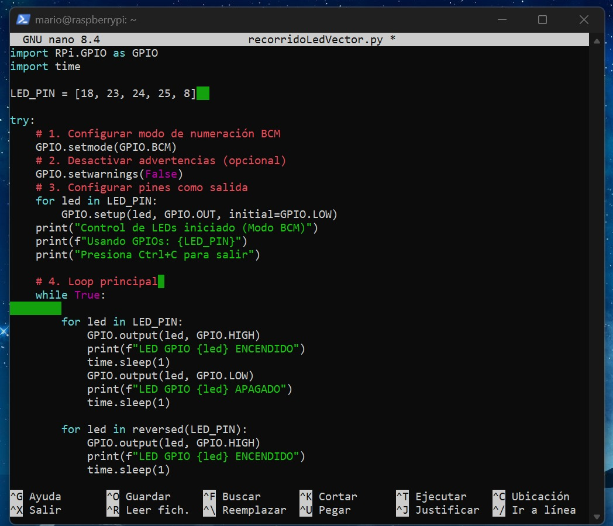
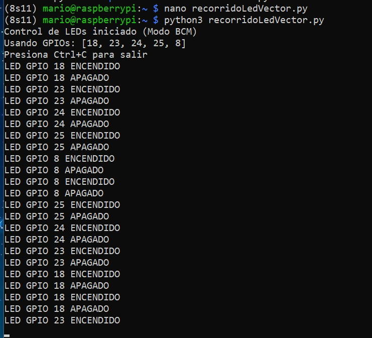
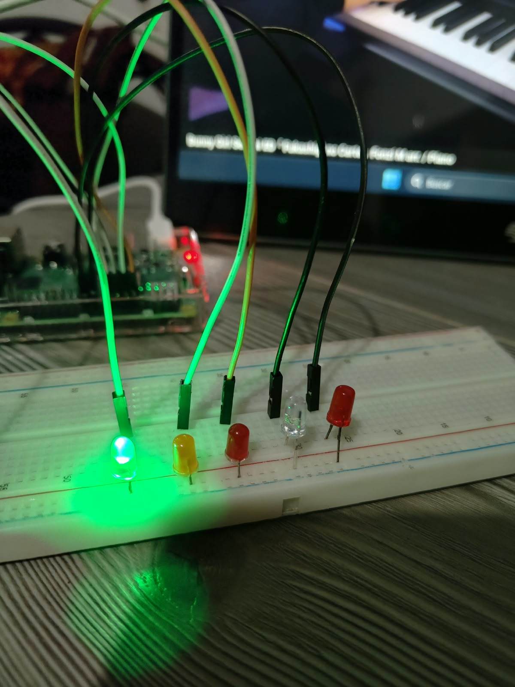
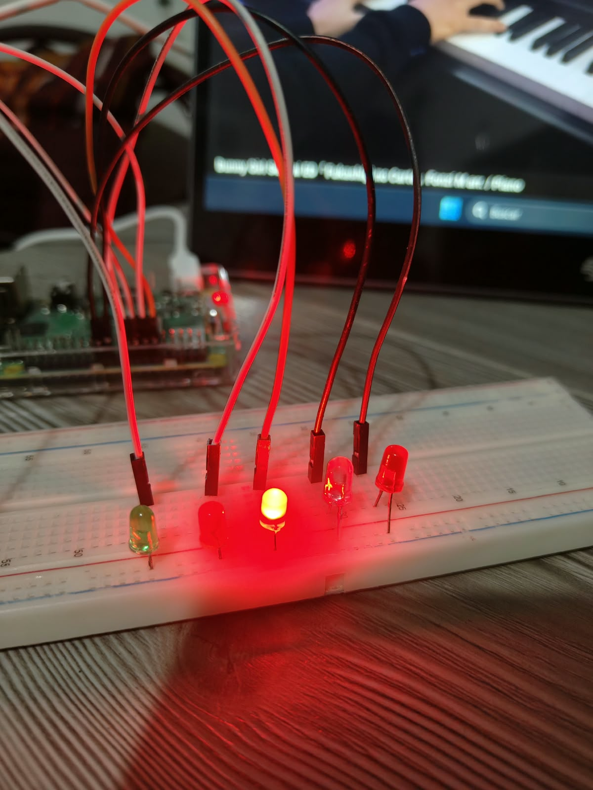
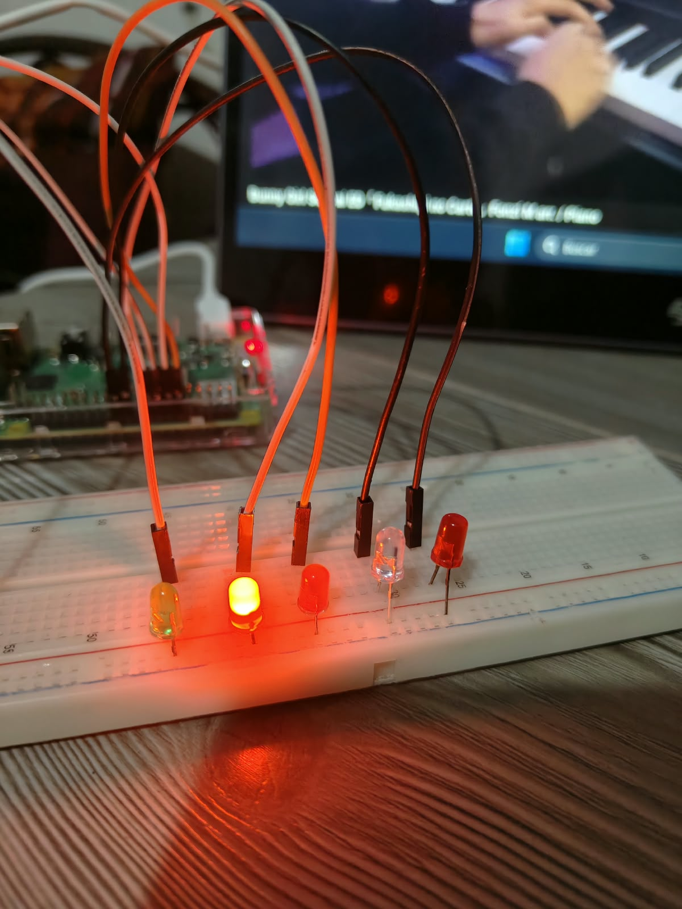
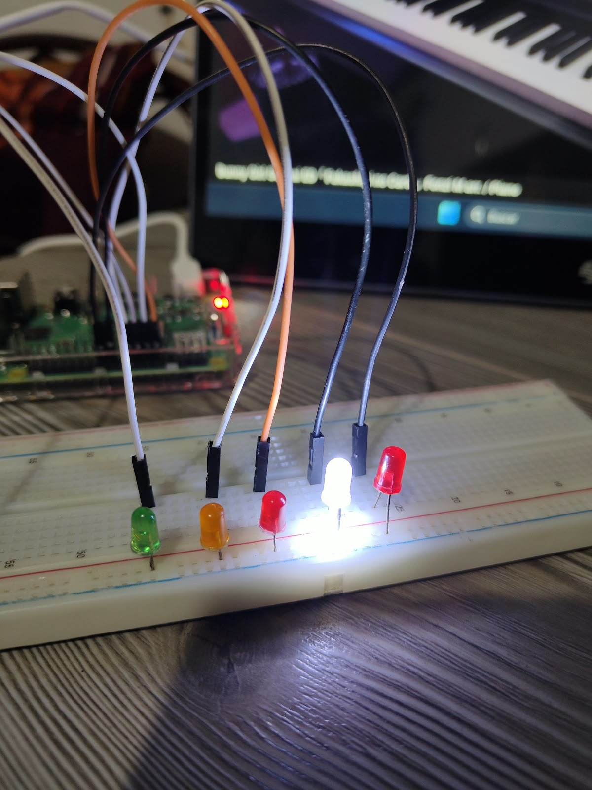
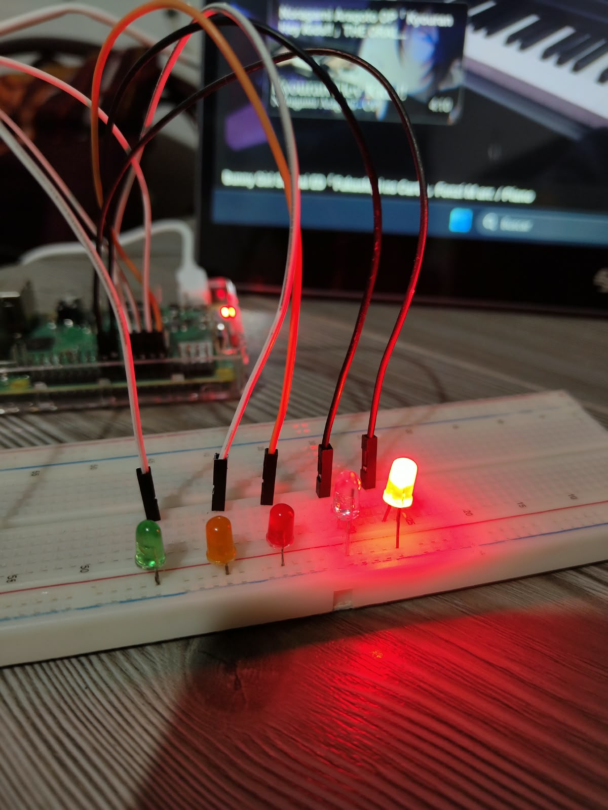

# P3 · Recorrido de LEDs con arreglo de pines

> Práctica 3: control secuencial de cinco LEDs en una Raspberry Pi usando una lista de pines GPIO en Python, con efecto de "ida y vuelta".

---

## 📖 Descripción general

En esta práctica se conectaron cinco LEDs a la Raspberry Pi y se encendieron uno por uno, primero de izquierda a derecha y luego de regreso, como un cursor que va y viene. La idea principal es no escribir un bloque de código por cada LED, sino guardar todos los pines en **una lista** y recorrerla con ciclos `for`.

El trabajo se hizo a distancia: desde mi computadora con Windows abrí una sesión SSH hacia la Raspberry, activé un entorno virtual de Python, escribí el script con `nano` y lo ejecuté en la placa.

---

## 🧰 Herramientas utilizadas

| Elemento | Detalle |
| :--- | :--- |
| Equipo de trabajo | Computadora con Windows (terminal con cliente SSH) |
| Dispositivo remoto | Raspberry Pi |
| Lenguaje | Python |
| Librería | `RPi.GPIO` |
| Entorno | Entorno virtual de Python (`8S11`) |
| Comunicación | SSH sobre red local |
| Editor | `nano` |

---

## 🔌 Conexión del circuito

Se utilizó la numeración **BCM**. Los LEDs van en el mismo orden que la lista del código:

| LED | GPIO (BCM) | Pin en la placa | Modo |
| :---: | :--- | :--- | :--- |
| 1 | GPIO 18 | Pin 12 | Salida |
| 2 | GPIO 23 | Pin 16 | Salida |
| 3 | GPIO 24 | Pin 18 | Salida |
| 4 | GPIO 25 | Pin 22 | Salida |
| 5 | GPIO 8 | Pin 24 | Salida |

---

## 🗂️ Estructura del repositorio

```text
P3_RecorridoLedVector/
├── recorridoLedVector.py
├── README.md
└── images/
    ├── nano.jpeg
    ├── terminal.jpeg
    ├── 1.jpeg
    ├── 2.jpeg
    ├── 3.jpeg
    ├── 4.jpeg
    └── 5.jpeg
```

---

## ▶️ Cómo reproducir la práctica

**1. Entrar a la Raspberry Pi por SSH**

```bash
ssh mario@192.168.137.160
```

**2. Activar el entorno virtual**

```bash
source 8S11/bin/activate
```

> Cuando está activo, el prompt muestra `(8S11)` al inicio de la línea.

**3. Crear y ejecutar el script**

```bash
nano recorridoLedVector.py
python recorridoLedVector.py
```

Para detener el programa se presiona `Ctrl + C`.

---

## 🧠 ¿Cómo funciona el programa?

1. **La lista de pines:** se declara `LED_PIN = [18, 23, 24, 25, 8]`, con los pines BCM de los cinco LEDs en orden. Así los ciclos `for` pueden manejar todos los LEDs sin repetir código.
2. **Configuración inicial:** se importan `RPi.GPIO` y `time`, se elige el modo BCM y se desactivan los avisos con `GPIO.setwarnings(False)`.
3. **Preparación de los pines:** un `for` recorre la lista y deja cada pin como salida en estado `LOW`, de modo que todos los LEDs empiezan apagados.
4. **Ciclo principal (`while True`):** repite indefinidamente dos recorridos:

   | Recorrido | Cómo se logra | Orden de los pines |
   | :--- | :--- | :--- |
   | ➡️ Ida | `for led in LED_PIN` | 18 → 23 → 24 → 25 → 8 |
   | ⬅️ Vuelta | `for led in reversed(LED_PIN)` | 8 → 25 → 24 → 23 → 18 |

   En ambos casos, cada LED se enciende 1 s y luego se apaga 1 s, mostrando su estado en la consola.
5. **Salida controlada:** un `try / except KeyboardInterrupt` detecta el `Ctrl + C`, rompe el ciclo y muestra un mensaje de interrupción.
6. **Limpieza:** el bloque `finally` ejecuta `GPIO.cleanup()` para liberar los pines y que ningún LED quede encendido.

---

## 🖼️ Evidencias

### Entorno y código

Edición del script en `nano`:



Ejecución en la terminal, con el mensaje inicial del programa:



### LEDs funcionando

Recorrido de los cinco LEDs durante la ejecución, tanto de ida como de vuelta:











Al presionar `Ctrl + C` el programa se detiene y limpia los pines.

---

## ✅ Conclusiones

Esta práctica mostró lo útil que es agrupar los pines en una lista: con pocos ciclos se controlan cinco LEDs y el mismo código se adapta fácilmente a más o menos salidas. También permitió practicar el recorrido de una lista en ambos sentidos con `reversed()` y reforzar el uso de `GPIO.cleanup()` al terminar.
